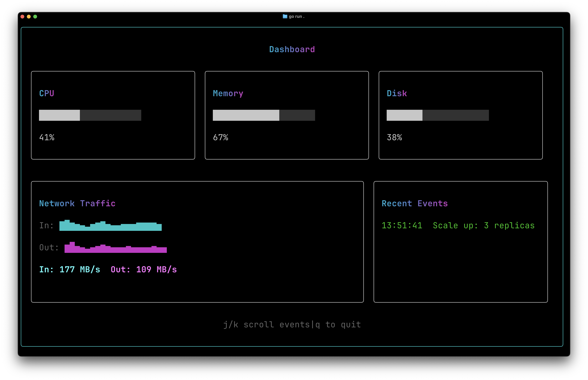

# Multi-Component

Shows how to structure multi-file applications with shared `State[T]` passed between parent and child components, and the mount system that caches children across renders.

## Screenshot



## Run

```bash
go run .
```

## Guide

For a detailed walkthrough, see the [Multi-Component guide](https://go-tui.dev/guide/multi-component).
