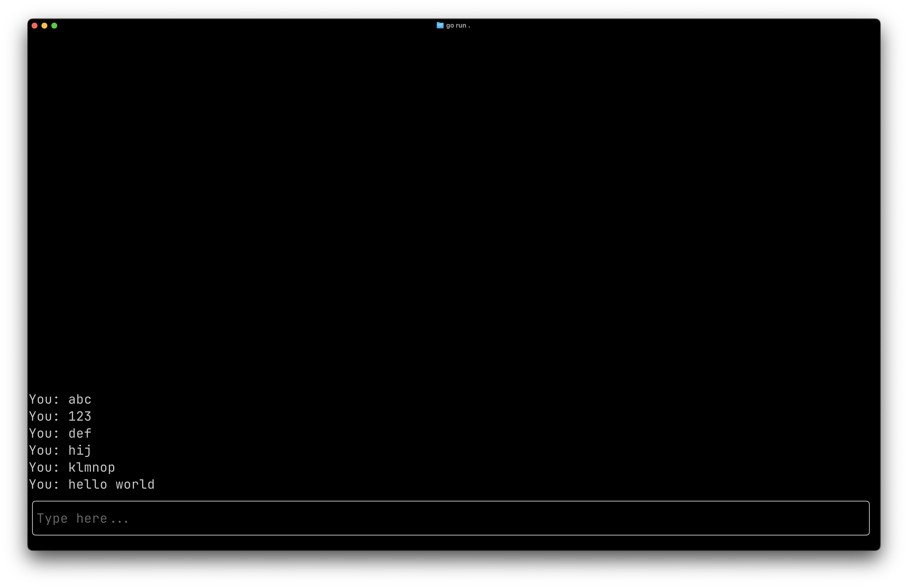

# Inline Mode

Demonstrates inline rendering where the UI occupies a fixed number of rows at the bottom of the terminal while everything above behaves like normal terminal output.

## Screenshot



## Run

```bash
go run .
```

## Guide

For a detailed walkthrough, see the [Inline Mode guide](https://go-tui.dev/guide/inline-mode).
