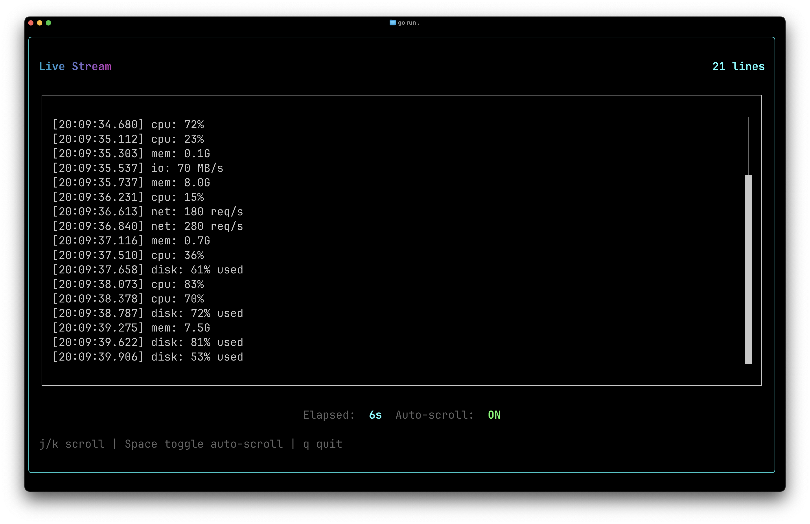

# Streaming

Builds a live data viewer that receives streaming data from a Go channel, with scrollable containers, auto-scroll, and stick-to-bottom behavior.

## Screenshot



## Run

```bash
go run .
```

## Guide

For a detailed walkthrough, see the [Streaming guide](https://go-tui.dev/guide/streaming).
