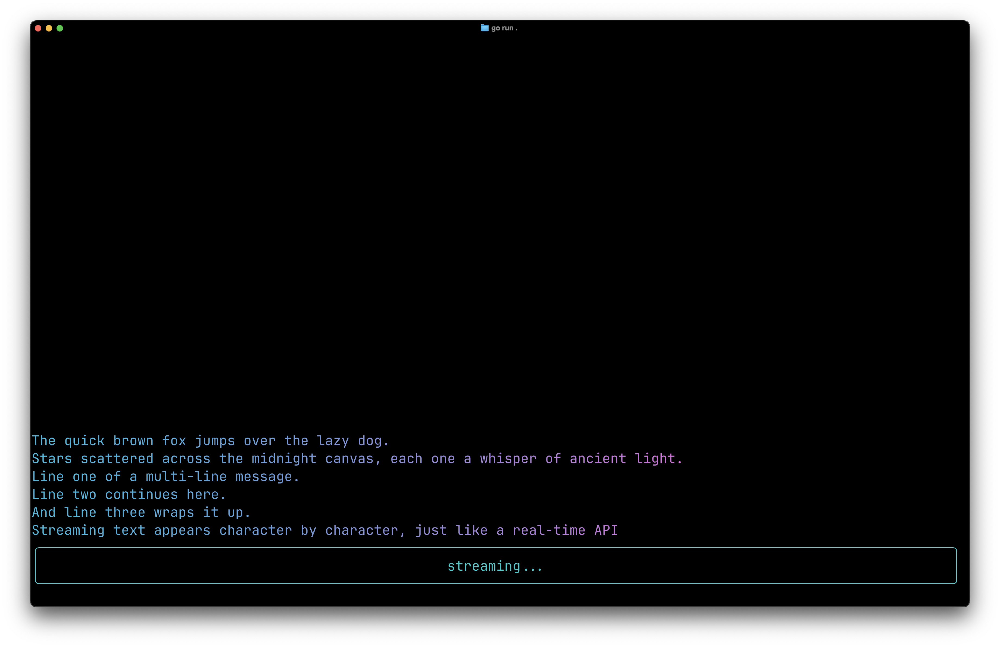

# Inline Streaming

Shows `StreamAbove()` for streaming text character-by-character into the history region above an inline widget, with styled output and `io.WriteCloser` support.

## Screenshot



## Run

```bash
go run .
```

## Guide

For a detailed walkthrough, see the [Inline Streaming guide](https://go-tui.dev/guide/inline-streaming).
